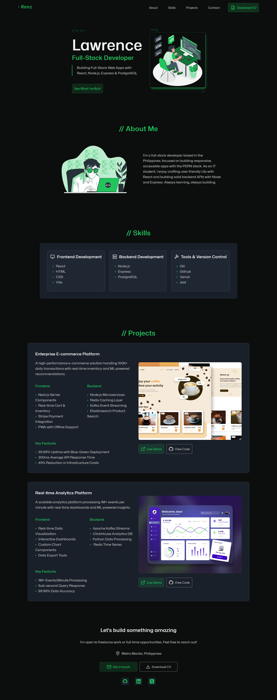
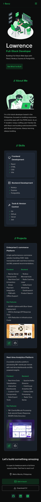
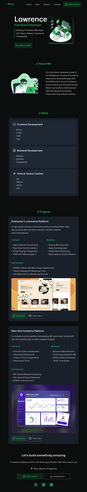

# Personal Homepage

A responsive and accessible portfolio website built with React, showcasing my projects, skills, and contact information.

## Features

- Fully responsive design (mobile-first)
- Semantic HTML5 and accessible components
- Animated navigation and section transitions
- Project showcase with live demos and source links

## Tech Stack

**Frontend:** React, Vite, CSS Modules  
**Deployment:** Vercel

## Responsive Views

### Desktop

### Mobile

### Tablet

## License

This project is licensed under the MIT License.
